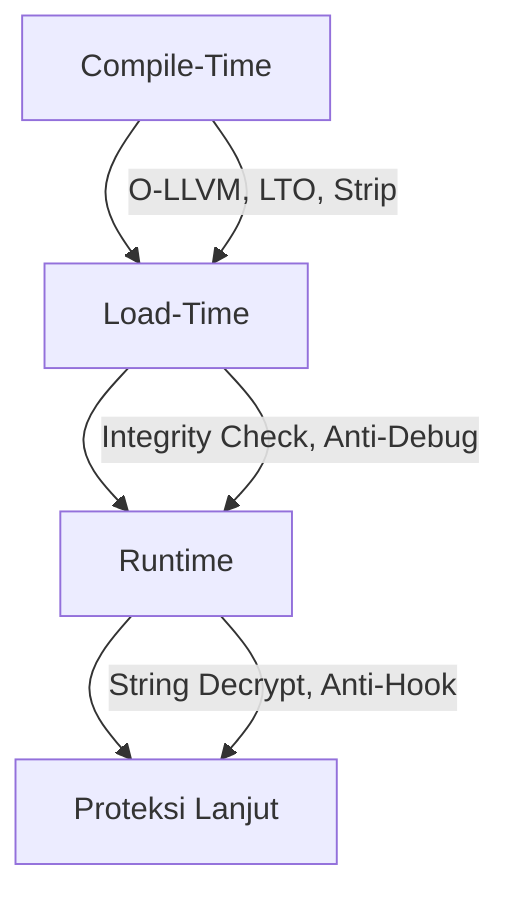

# Proteksi SO dari Kacamata Reverse Menurut aku ya

*Ditulis oleh @Qwanwin*  

Kalau kamu sering ngoprek aplikasi Android, pasti udah kenal sama file **.so** alias shared object.  
File ini biasanya isinya logika inti aplikasi, algoritma penting, atau data sensitif. Kalau sampai dibongkar, ya wassalam.  

Nah, di artikel ini kita bakal bahas berbagai trik buat ngejaga file `.so` biar nggak gampang dilahap sama reverse engineer.  
Bahasnya santai aja, tapi isinya tetap teknis dan bisa langsung dipraktekin.  

> Ingat: proteksi itu nggak ada yang 100% aman. Target kita cuma bikin si pembongkar mikir dua kali dan butuh waktu lebih lama.


## 2. Proteksi Waktu Kompilasi (Compile-Time)  

### 2.1 Obfuscasi C/C++ pakai O-LLVM  
- **Control Flow Flattening** → Bikin alur kode jadi muter-muter dan ribet.  
- **Instruction Substitution** → Ganti instruksi gampang jadi versi ribet tapi fungsinya sama.  
- **Bogus Control Flow** → Masukin jalur palsu yang nggak kepake biar analisis statis pusing.  
- **String Encryption** → Enkripsi string di compile-time, baru dibuka di runtime.  

> Cara simpel: integrasiin **Obfuscator-LLVM** ke toolchain NDK kamu. Memang agak ribet setup-nya, tapi hasilnya mantap.

### 2.2 Tingkat Optimasi Tinggi  
Pakai flag `-O2`, `-O3`, atau `-Os` buat bikin kode jadi lebih sulit dibaca saat di-decompile:  
```cmake
set(CMAKE_CXX_FLAGS_RELEASE "${CMAKE_CXX_FLAGS_RELEASE} -O3")
```

### 2.3 Link-Time Optimization (LTO)  
Optimalisasi lintas file supaya logika makin sulit ditebak:  
```cmake
set(CMAKE_CXX_FLAGS_RELEASE "${CMAKE_CXX_FLAGS_RELEASE} -flto")
```

### 2.4 Strip Symbol  
Hilangkan tabel simbol biar nama fungsi dan variabel nggak bocor:  
```cmake
set(CMAKE_CXX_FLAGS_RELEASE "${CMAKE_CXX_FLAGS_RELEASE} -s")
```

### 2.5 Matikan RTTI & Exceptions  
Kalau nggak butuh RTTI atau pengecualian, matiin aja:  
```cmake
set(CMAKE_CXX_FLAGS_RELEASE "${CMAKE_CXX_FLAGS_RELEASE} -fno-rtti -fno-exceptions")
```

### 2.6 Visibilitas  
Buat fungsi internal nggak kelihatan dari luar:  
```cpp
#define API_EXPORT __attribute__((visibility("default")))
#define INTERNAL_FUNC __attribute__((visibility("hidden")))
```


## 3. Contoh enc String Penting  

### 3.1 XOR Runtime  
```cpp
std::string decrypt(const char* enc, size_t len, char key) {
    std::string out(len, '\0');
    for (size_t i = 0; i < len; ++i) out[i] = enc[i] ^ key;
    return out;
}
```

### 3.2 Contoh String  
```cpp
std::string secret = "sec" + std::string("ret_") + "key";
```

### 3.3 Bangun String di Stack  
```cpp
char key[7] = {'s','e','c','r','e','t','\0'};
```

### 3.4 Matikan Log Sensitif  
Release build wajib nggak ada log info penting, apalagi kunci atau nama fungsi.  

### 3.5 Lindungi Kunci  
Kalau kunci penting, jangan hardcode mentah. Bisa simpan di server, atau kalau mau ribet dikit, pakai **white-box cryptography**.

---

## 4. Proteksi Waktu Jalan (Runtime)  

### 4.1 Anti-Debug  
- Cek `/proc/self/status` → `TracerPid`.  
- `ptrace(PTRACE_TRACEME, 0, 0, 0)`.  
- Pastikan manifest nggak `android:debuggable`.  

### 4.2 Cek Integrity 
- Hitung CRC32/MD5/SHA1 pas runtime.  
- Bandingin sama hash yang udah disimpan aman di server atau di-enkripsi.  

### 4.3 Obfuscasi Nama Fungsi JNI  
Daftarin fungsi lewat `RegisterNatives()` biar nggak keliatan aslinya.  

## 5. saran proteksi

### 5.1 Anti Dump Memory  
- Enkripsi section `.text` dan buka cuma pas dipakai.  
- Pakai self-modifying code buat fungsi penting.  

### 5.2 Anti Hooking (Frida/Xposed)  
- Scan `/proc/self/maps` buat cari modul aneh.  
- Validasi pointer JNI biar nggak di-overwrite.  

### 5.3 Deteksi Lingkungan Aneh  
- Cek delay eksekusi (indikasi breakpoint).  
- Pantau env var seperti `LD_LIBRARY_PATH` dan `LD_PRELOAD`.  


## 6. Alur Proteksi Multi-Layer  



## 7. Tips Tambahan  

- Campur teknik compile-time dan runtime biar proteksi nggak cuma satu lapis.  
- Tes di berbagai device, dari low-end sampai flagship, biar nggak crash.  
- Proteksi yang terlalu ribet bisa bikin performa drop, jadi seimbangin.  
- Kalau mau lebih aman, kombinasikan proteksi `.so` sama proteksi di Java/Kotlin layer.  


Nggak ada sistem yang 100% aman. Tujuan proteksi `.so` adalah bikin proses bongkar jadi ribet dan makan waktu.  
Kalau si pembongkar udah frustasi di tengah jalan, berarti misi berhasil.  

Terimakasih Sudah membaca. semoga bermanfaat
