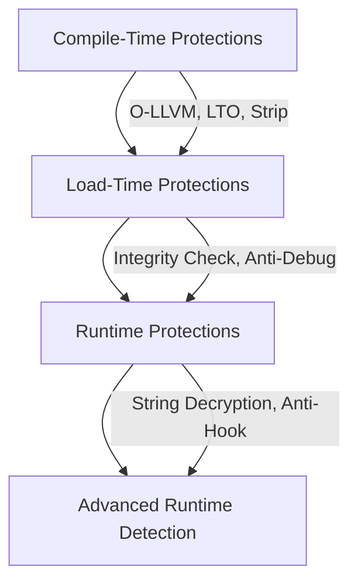

# Discussing SO Protection from a Reverse Perspective  
*Written by @Qwanwin*  

##  Introduction  
As an Android reverse engineer, a large part of our work involves analyzing **.so files**.  
These shared libraries often contain core logic and sensitive data, making them valuable targets.  
Plaintext strings and function names in particular can be critical vulnerabilities.  

From an attacker's perspective, improving `.so` file protection is key.  
Here are practical solutions — requiring minimal coding — that can significantly improve security standards.  
> **Note:** This content assumes familiarity with Android NDK development.
>
> 
### 3.1 Code Obfuscation (O-LLVM)  
- **Control Flow Flattening** – Complex jump logic disrupts static analysis.  
- **Instruction Substitution** – Replace simple instructions with complex but equivalent operations.  
- **Bogus Control Flow** – Insert meaningless jumps to mislead reverse analysis.  
- **String Encryption** – Compile-time encryption, runtime decryption.  

**Key Point:** Integrate **Obfuscator-LLVM (O-LLVM)** into your NDK toolchain for maximum effect.  

### 3.2 High Optimization Levels  
```cmake
set(CMAKE_CXX_FLAGS_RELEASE "${CMAKE_CXX_FLAGS_RELEASE} -O3")
```

### 3.3 Link-Time Optimization (LTO)  
```cmake
set(CMAKE_CXX_FLAGS_RELEASE "${CMAKE_CXX_FLAGS_RELEASE} -flto")
```

### 3.4 Symbol Stripping  
```cmake
set(CMAKE_CXX_FLAGS_RELEASE "${CMAKE_CXX_FLAGS_RELEASE} -s")
```

### 3.5 Disable RTTI & Exceptions  
```cmake
set(CMAKE_CXX_FLAGS_RELEASE "${CMAKE_CXX_FLAGS_RELEASE} -fno-rtti -fno-exceptions")
```

### 3.6 Symbol Visibility Control  
```cpp
#define API_EXPORT __attribute__((visibility("default")))
#define INTERNAL_FUNC __attribute__((visibility("hidden")))
```


## 4. String Protection Techniques  

### 4.1 Runtime XOR Encryption
```cpp
std::string decrypt(const char* enc, size_t len, char key) {
    std::string out(len, '\0');
    for (size_t i = 0; i < len; ++i) out[i] = enc[i] ^ key;
    return out;
}
```

### 4.2 String Splitting & Reassembly
```cpp
std::string secret = "sec" + std::string("ret_") + "key";
```

### 4.3 Stack-Built Strings
```cpp
char key[7] = {'s','e','c','r','e','t','\0'};
```

### 4.4 No Sensitive Logging  
Remove or disable `LOGE`/`LOGD` output in release builds.  

### 4.5 Key Protection  
Consider **white-box cryptography** for high-value keys.  


## 5. Runtime Protections  

### 5.1 Anti-Debugging  
- Check `/proc/self/status` → `TracerPid`.  
- Use `ptrace(PTRACE_TRACEME, 0, 0, 0)`.  
- Disable `android:debuggable` in manifest.  

### 5.2 Integrity Verification  
- Compute CRC32/MD5/SHA1 at runtime.  
- Compare against pre-stored secure hash.  

### 5.3 JNI Function Name Obfuscation  
- Use `RegisterNatives()` to register native methods dynamically.  


## 6. Advanced Protections  

### 6.1 Anti-Memory Dump  
- Encrypt `.text` section in memory, decrypt only on demand.  
- Use self-modifying code for sensitive functions.  

### 6.2 Anti-Hooking Runtime  
- Scan `/proc/self/maps` for suspicious libraries (Frida, Xposed).  
- Verify JNI function pointers at runtime.  

### 6.3 Side-Channel Detection  
- Measure execution timing to detect breakpoints.  
- Detect environment variable changes (`LD_LIBRARY_PATH`, `LD_PRELOAD`).  


## 7. Multi-Layer Protection Flow  




## 8. Strategic Considerations  

| Factor        | Impact |
|---------------|--------|
| Complexity    | O-LLVM requires toolchain modification |
| Performance   | Runtime decryption can slow execution |
| Debugging     | Heavily obfuscated code is harder to debug |
| Stability     | Poor obfuscation may cause crashes |
| Compatibility | Must run on high-, mid-, and low-end devices |


## 9. Conclusion  
Even major vendors often use *moderate* SO protection — not due to lack of capability, but to maintain stability, compatibility, and performance.  
A balanced approach between **security, stability, and performance** is key.  


